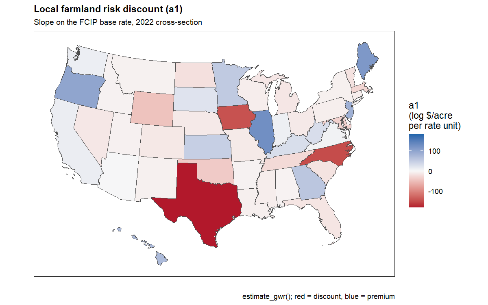
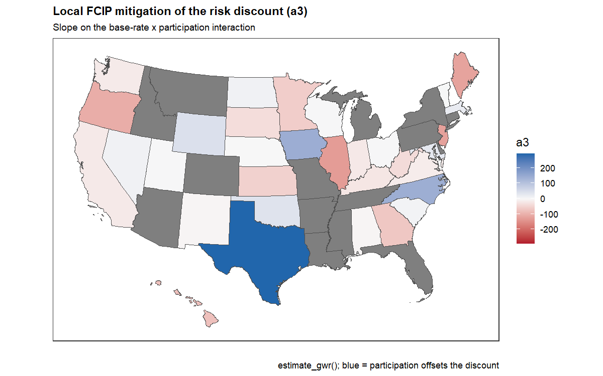
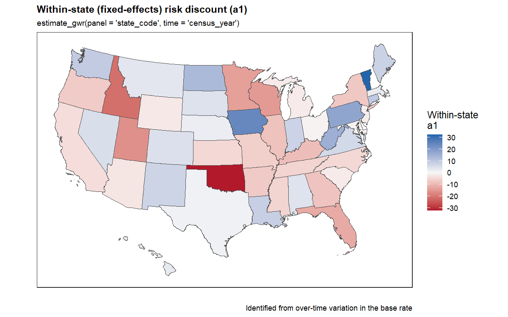

gwkit example 01 — `estimate_gwr()`: the farmland risk discount and its
FCIP offset
================

**Question.** Does farmland trade at a *risk discount* — cheaper where
production risk is higher — and does the Federal Crop Insurance Program
(FCIP) offset that discount where participation is high?

We proxy assessed production risk with the FCIP **base premium rate**
(`fcip_base_rate` = `r`), measure participation with `fcip_adoption`
(`x`), and fit the local regression

$$Y = a_0 + a_1\,r + a_2\,x + a_3\,(r\cdot x) + \text{(state FE)},$$

with `Y = log(ag_land_value_per_acre)` (coded as the column `lv`; avoid
naming a model column `X`/`Y`, which collide with gwkit’s internal
coordinate columns). Here `a1` is the **risk discount** (expected `< 0`)
and `a3` the **FCIP mitigation** (expected `> 0`: participation softens
the discount). `estimate_gwr()` fits this *locally* at every state, so
`a1` and `a3` are mapped rather than assumed constant.

> The bundled `us_state_ag_census` is state-level and used here as a
> methods demo; the substantive design is county-level.

``` r
library(data.table); library(sf); library(ggplot2)
source("_setup.R")     # loads gwkit (dev tree if present) + the ERS framework

data(us_state_ag_census)
d <- data.table::copy(us_state_ag_census)
d[, lv           := log(ag_land_value_per_acre)]   # log land value / acre
d[, base_rate    := fcip_base_rate]                # r: risk proxy
d[, participation := fcip_adoption]                # x: FCIP participation
d[, rate_x_part  := base_rate * participation]     # r*x as an explicit column
d <- d[is.finite(lv) & is.finite(base_rate) & is.finite(participation)]

d_cs <- d[census_year == max(census_year)]         # latest wave for the maps

states <- urbnmapr::get_urbn_map("states", sf = TRUE)
states$state_code <- as.integer(states$state_fips)
states <- states[states$state_code %in% d_cs$state_code, ]
```

## Cross-sectional GWR

A polygon layer is passed as `geometry`, so gwkit reduces each state to
its point-on-surface and fits the model in each state’s neighbourhood.
The interaction is supplied as the pre-built `rate_x_part` column.

``` r
gwr <- estimate_gwr(
  data = d_cs, unit = "state_code",
  formula  = lv ~ base_rate + participation + rate_x_part,
  geometry = states, poly_id = "state_code",
  distance_metric = "Great Circle", kernel = "bisquare",
  adaptive = TRUE, bw = 12)

# a1 = local risk discount (slope on the base rate)
a1 <- gwr[term == "base_rate"  & estimand == "mean",
          .(state_code = as.integer(unit_id), a1 = estimate)]
# a3 = local FCIP mitigation (slope on the rate x participation interaction)
a3 <- gwr[term == "rate_x_part" & estimand == "mean",
          .(state_code = as.integer(unit_id), a3 = estimate)]
head(merge(a1, a3, by = "state_code"))
```

    ## Key: <state_code>
    ##    state_code          a1        a3
    ##         <int>       <num>     <num>
    ## 1:          1  -3.9198903  -3.53885
    ## 2:          4   0.5811049        NA
    ## 3:          5  -5.0747287        NA
    ## 4:          6  11.5254353 -19.23916
    ## 5:          8 -13.3783635        NA
    ## 6:          9  -8.9604985        NA

``` r
m1 <- merge(states, a1, by = "state_code")
gw_diverging_map(
  m1, "a1",
  title    = "Local farmland risk discount (a1)",
  subtitle = paste("Slope on the FCIP base rate,", max(d_cs$census_year),
                   "cross-section"),
  legend   = "a1\n(log $/acre\nper rate unit)",
  caption  = "estimate_gwr(); red = discount, blue = premium")
```

<!-- -->

``` r
m3 <- merge(states, a3, by = "state_code")
gw_diverging_map(
  m3, "a3",
  title    = "Local FCIP mitigation of the risk discount (a3)",
  subtitle = "Slope on the base-rate x participation interaction",
  legend   = "a3",
  caption  = "estimate_gwr(); blue = participation offsets the discount")
```

<!-- -->

Where `a1` is red the discount is present; where `a3` is blue, higher
participation offsets it — the two maps together are the hypothesis made
spatial.

## Fixed-effects panel GWR

Cross-sectional `a1` conflates the risk gradient with permanent
between-state level differences. With the full state × census-year
panel, `panel`/`time` absorb each state’s fixed effect
(Frisch–Waugh–Lovell), so `a1` is identified from **within-state,
over-time** variation in the base rate (`model_estimator == "gwfe"`).
The demeaning is applied to each covariate column, including the
pre-built `rate_x_part`.

``` r
gwfe <- estimate_gwr(
  data = d, unit = "state_code",
  formula = lv ~ base_rate + participation + rate_x_part,
  panel = "state_code", time = "census_year",
  geometry = states, poly_id = "state_code",
  distance_metric = "Great Circle", kernel = "bisquare",
  adaptive = TRUE, bw = 12, fit_stats = TRUE)

unique(gwfe$model_estimator)
```

    ## [1] "gwfe"

``` r
fe_a1 <- gwfe[term == "base_rate",
              .(state_code = as.integer(unit_id), a1 = estimate)]

mfe <- merge(states, fe_a1, by = "state_code")
gw_diverging_map(
  mfe, "a1",
  title    = "Within-state (fixed-effects) risk discount (a1)",
  subtitle = "estimate_gwr(panel = 'state_code', time = 'census_year')",
  legend   = "Within-state\na1",
  caption  = "Identified from over-time variation in the base rate")
```

<!-- -->

**Caveat.** The within estimate rests on states’ risk *perception*
having evolved differently over time, net of mean returns. If long-run
risk perception is stable, the FE `a1` is weakly identified — a
limitation to argue explicitly rather than assume away.
