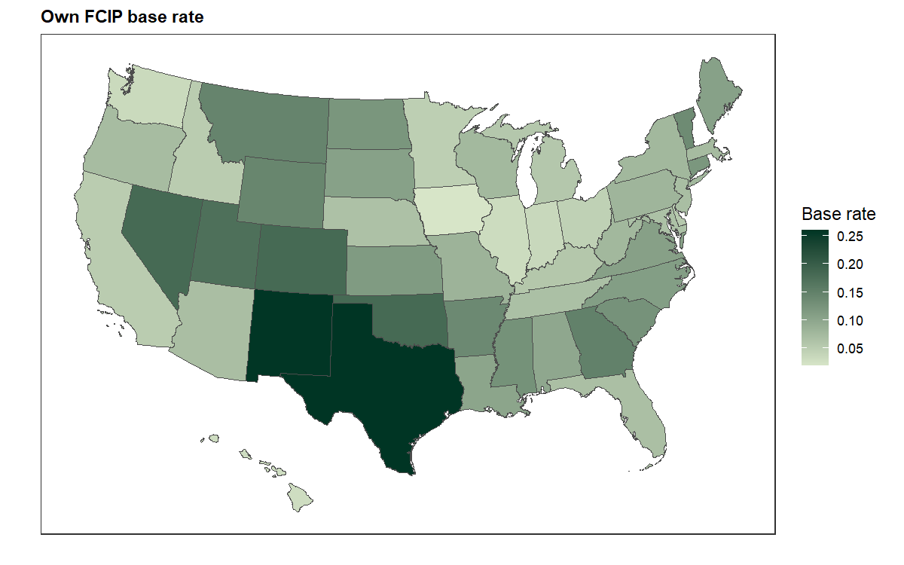
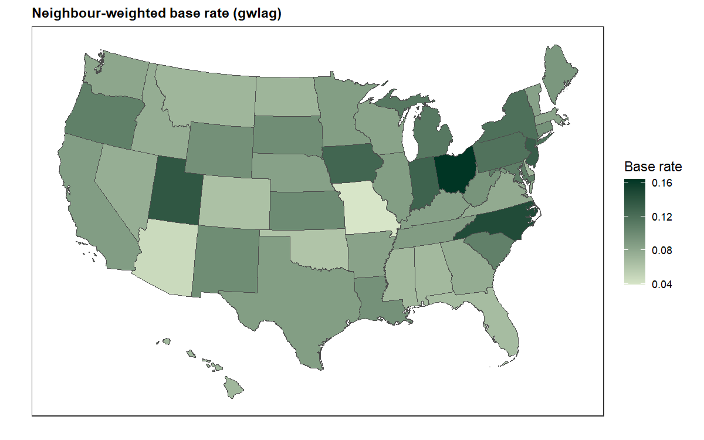

gwkit example 02 — `estimate_gwlag()`: the surrounding risk & insurance
environment
================

A state’s farmland is priced partly against its *regional* context — the
risk and insurance environment of its neighbours. `estimate_gwlag()` is
a **spatial lag**: the geographically weighted mean of a variable over a
unit’s *neighbours* (`include_self = FALSE`). Here it summarises the
surrounding FCIP base rate (the regional risk climate) and surrounding
participation (regional insurance uptake) — the kind of
neighbouring-exposure terms that enter an availability/spillover
specification.

``` r
library(data.table); library(sf); library(ggplot2)
source("_setup.R")     # loads gwkit (dev tree if present) + the ERS framework

data(us_state_ag_census)
d <- data.table::copy(us_state_ag_census)
d[, base_rate     := fcip_base_rate]
d[, participation := fcip_adoption]
d <- d[is.finite(base_rate) & is.finite(participation) &
         census_year == max(census_year)]

states <- urbnmapr::get_urbn_map("states", sf = TRUE)
states$state_code <- as.integer(states$state_fips)
states <- states[states$state_code %in% d$state_code, ]
```

``` r
lagged <- estimate_gwlag(
  data = d, unit = "state_code",
  value_cols = c("base_rate", "participation"),
  geometry = states, poly_id = "state_code",
  distance_metric = "Great Circle", kernel = "bisquare",
  adaptive = TRUE, bw = 8, include_self = FALSE)   # strict neighbour mean

lagged[, state_code := as.integer(state_code)]
head(lagged)   # *_LM columns = neighbour-weighted means
```

    ##    state_code base_rate_LM participation_LM
    ##         <int>        <num>            <num>
    ## 1:          1   0.06807334        0.5554376
    ## 2:          4   0.04632783        1.0000000
    ## 3:          8   0.06274396        1.0000000
    ## 4:          9   0.09535302        0.9933266
    ## 5:         12   0.06600940        1.0000000
    ## 6:         13   0.07642718        0.9999675

``` r
# own vs neighbour-weighted FCIP base rate (the regional risk climate)
m_own <- merge(states, d[, .(state_code, val = base_rate)], by = "state_code")
m_lag <- merge(states, lagged[, .(state_code, val = base_rate_LM)], by = "state_code")

p_own <- gw_sequential_map(m_own, "val",
  title = "Own FCIP base rate", legend = "Base rate")
p_lag <- gw_sequential_map(m_lag, "val",
  title = "Neighbour-weighted base rate (gwlag)", legend = "Base rate")
p_own
```

<!-- -->

``` r
p_lag
```

<!-- -->

The lagged surface is smoother than the raw one: each state now carries
the risk climate of the region around it. Used as a regressor,
`base_rate_LM` captures spillovers — whether farmland is discounted for
*regional* risk beyond a state’s own — while `participation_LM` proxies
the surrounding insurance uptake.
