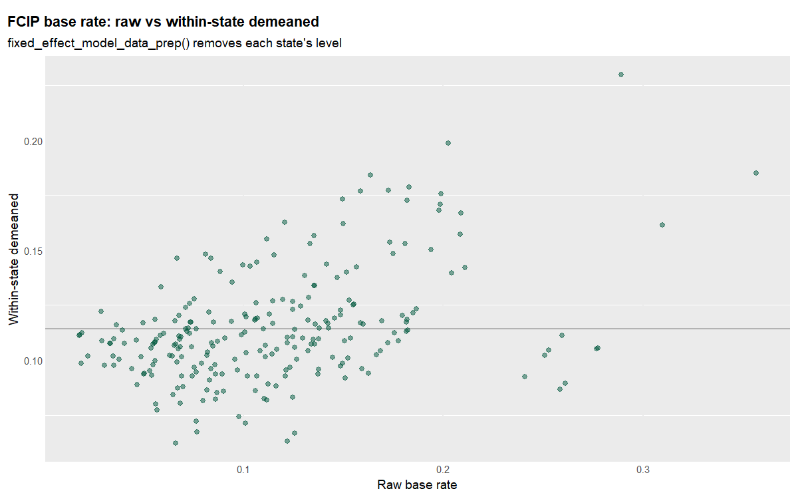

gwkit example 06 — building blocks: distance-metric presets & the FE
identification problem
================

The estimators are built on a few small exported helpers. This example
shows two of them directly, and uses the second to make the study’s
central **identification concern** concrete: separating the risk
variable from cross-sectional fixed effects.

``` r
library(data.table); library(ggplot2)
source("_setup.R")     # loads gwkit (dev tree if present) + the ERS framework
```

## Distance-metric presets

`gw_distance_metric_names()` lists the presets;
`resolve_distance_metric()` returns the `(p, theta, longlat)` triple
each one hands to `GWmodel::gw.dist()`. The spec grids in examples 04–05
iterate over exactly these names.

``` r
gw_distance_metric_names()
```

    ##  [1] "Euclidean"                           "Euclidean (rotated theta=0.8)"       "Manhattan"                          
    ##  [4] "Manhattan (rotated theta=0.5)"       "Minkowski p=1.5"                     "Minkowski p=1.5 (rotated theta=0.8)"
    ##  [7] "Minkowski p=3"                       "Minkowski p=3 (rotated theta=0.8)"   "Chebyshev (approx L_inf, p = 10)"   
    ## [10] "Great Circle"

``` r
presets <- gw_distance_metric_presets()
data.table::rbindlist(lapply(names(presets), function(nm) {
  x <- presets[[nm]]
  data.table(preset = nm, p = x$p, theta = x$theta, longlat = x$longlat)
}))
```

    ##                                  preset     p theta longlat
    ##                                  <char> <num> <num>  <lgcl>
    ##  1:                           Euclidean   2.0   0.0   FALSE
    ##  2:       Euclidean (rotated theta=0.8)   2.0   0.8   FALSE
    ##  3:                           Manhattan   1.0   0.0   FALSE
    ##  4:       Manhattan (rotated theta=0.5)   1.0   0.5   FALSE
    ##  5:                     Minkowski p=1.5   1.5   0.0   FALSE
    ##  6: Minkowski p=1.5 (rotated theta=0.8)   1.5   0.8   FALSE
    ##  7:                       Minkowski p=3   3.0   0.0   FALSE
    ##  8:   Minkowski p=3 (rotated theta=0.8)   3.0   0.8   FALSE
    ##  9:    Chebyshev (approx L_inf, p = 10)  10.0   0.0   FALSE
    ## 10:                        Great Circle   2.0   0.0    TRUE

``` r
resolve_distance_metric("Great Circle")          # geodesic
```

    ## $p
    ## [1] 2
    ## 
    ## $theta
    ## [1] 0
    ## 
    ## $longlat
    ## [1] TRUE

## Fixed-effects demeaning and the identification concern

`fixed_effect_model_data_prep()` implements the within transform that
`estimate_gwr(panel=, time=)` uses internally: it drops singleton panels
and replaces each variable by `value − panel_mean + grand_mean`. The
point of the example study is that the **risk discount** `a1` is fragile
precisely because the FCIP base rate varies far more *between* states
than *within* them over time — so demeaning strips most of its
variation.

``` r
data(us_state_ag_census)
d <- data.table::copy(us_state_ag_census)
d[, lv        := log(ag_land_value_per_acre)]
d[, base_rate := fcip_base_rate]
d <- d[is.finite(lv) & is.finite(base_rate)]

prep <- fixed_effect_model_data_prep(
  data = d, varlist = c("base_rate", "lv"),
  panel = "state_code", time = "census_year")

prep$NFE                        # number of states with >1 census wave
```

    ## [1] 47

``` r
# how much of the base-rate variance is between- vs within-state?
bw_share <- d[, {
  gm <- mean(base_rate, na.rm = TRUE)
  sm <- .SD[, .(mu = mean(base_rate, na.rm = TRUE), n = .N), by = state_code]
  between <- sum(sm$n * (sm$mu - gm)^2, na.rm = TRUE)
  total   <- sum((base_rate - gm)^2, na.rm = TRUE)
  .(between_share = between / total)
}]
bw_share      # closer to 1 => within-state (FE) identification is thin
```

    ##    between_share
    ##            <num>
    ## 1:      0.812739

``` r
raw <- d[, .(state_code, census_year, raw = base_rate)]
dm  <- prep$data[, .(state_code, census_year, demeaned = base_rate)]
cmp <- merge(raw, dm, by = c("state_code", "census_year"))

ggplot(cmp, aes(raw, demeaned)) +
  geom_hline(yintercept = mean(cmp$demeaned), colour = "grey70") +
  geom_point(alpha = 0.5, colour = "#00583D") +
  labs(title = "FCIP base rate: raw vs within-state demeaned",
       subtitle = "fixed_effect_model_data_prep() removes each state's level",
       x = "Raw base rate", y = "Within-state demeaned") +
  ers_theme() +
  theme(axis.title.y = element_text(), panel.grid.major.x = element_line(colour = "grey92"))
```

<!-- -->

The vertical spread at each raw value is the between-state level the
fixed effect absorbs; the demeaned series — narrow if `between_share` is
high — is all a GWFE `a1` is identified from. That is the caveat flagged
in example 01, shown as data: without meaningful within-state movement
in assessed risk, the fixed-effects risk discount rests on very little.
